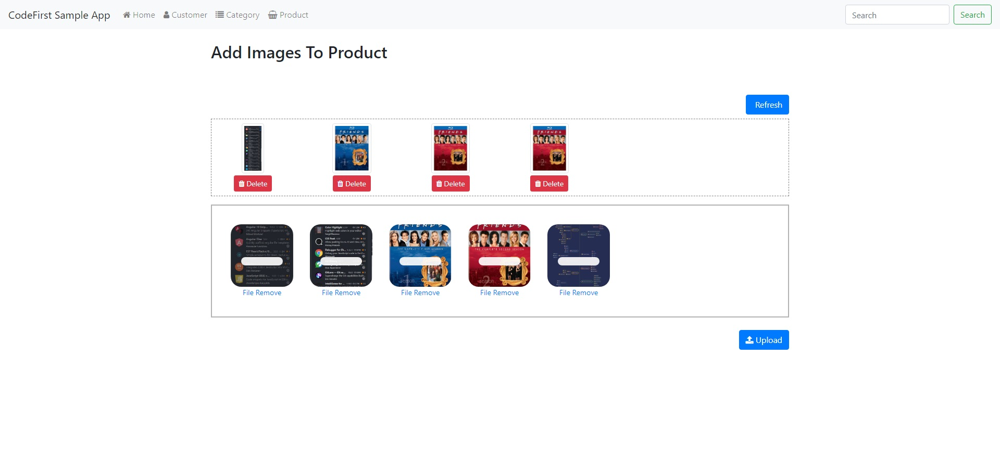

# Asp.net Mvc - File Upload with DropzoneJS
> With this project, you can add / delete pictures.

## Table of contents
* [General info](#general-info)
* [Screenshots](#screenshots)
* [Technologies](#technologies)
* [Setup](#setup)
* [Features](#features)
* [Status](#status)
* [Inspiration](#inspiration)
* [Contact](#contact)

## General info
You can make modern and effective projects by using jquery and dropzone libraries.

## Screenshots

## Technologies
* Tech 1 - version 1.0
* Tech 2 - version 2.0
* Tech 3 - version 3.0

## Setup
Describe how to install / setup your local environement / add link to demo version.

## Code Examples
Show examples of usage:
`

        Dropzone.autoDiscover = false;
        $(function () {
            var dz = null;
            $("#mydropzone").dropzone({
                autoProcessQueue: false,
                paramName: "productpictures",
                maxFilesize: 1, //mb
                maxThumbnailFilesize: 1, //mb
                maxFiles: 5,
                parallelUploads: 5,
                acceptedFiles: ".jpeg,.png,.jpg",
                uploadMultiple: true,
                addRemoveLinks: true,
                //resizeWidth:128,
                init: function () {
                    dz = this;
                    $("#uploadbutton").click(function () {
                        dz.processQueue();
                        $(this).attr("disabled", "disabled");
                    });
                },
                success: function (file) {
                    var preview = $(file.previewElement);
                    preview.addClass("dz-success text-success");
                    setTimeout(function () {
                        dz.removeFile(file);
                        $("#refreshbutton").click();
                    }, 2000);
                },
                queuecomplete: function () {
                    $("#refreshbutton").click();
                    $("#uploadbutton").removeAttr("disabled");
                },
                dictDefaultMessage: "You can drag and drop your images here.",
                dictRemoveFile: "File Remove"
            });
            $("#refreshbutton").prepend('<i id="loading" class="fa fa-refresh fa-spin" style="display:none;"></i>&nbsp;')
            refreshProductPicture();
        });
        function refreshProductPicture() {
            $("#refreshbutton").click();
        }
    `

## Features
List of features ready and TODOs for future development
* Awesome feature 1
* Awesome feature 2
* Awesome feature 3

To-do list:
* Wow improvement to be done 1
* Wow improvement to be done 2

## Status
Project is: _in progress_, _finished_, _no longer continue_ and why?

## Inspiration
Add here credits. Project inspired by..., based on...

## Contact
Created by [@flynerdpl](https://www.flynerd.pl/) - feel free to contact me! +  

